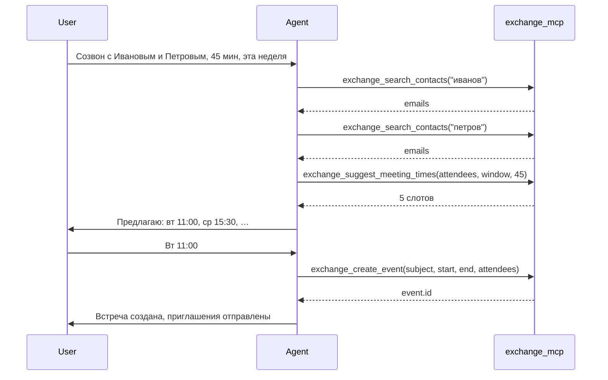

# RFC 0002: подбор времени встречи — availability и поиск контактов

| Поле | Значение |
| --- | --- |
| **Репозиторий** | [poker26/exchange_mcp](https://github.com/poker26/exchange_mcp) |
| **Статус** | Implemented |
| **Дата** | 2026-05-19 |
| **Зависимости** | RFC 0001 (create/update event), exchangelib ≥ 5.4 |
| **Затронутые области** | `exchange_mcp/tools/calendar.py`, `exchange_mcp/tools/contacts.py`, `exchange_mcp/router.py`, `exchange_mcp/backends/base.py`, `exchange_mcp/backends/ews.py`, MCP-схема инструментов |

## Резюме

Добавить в Exchange MCP инструменты для сценария **«назначить встречу нескольким участникам и подобрать общее свободное время»**. Сейчас агент видит только календарь владельца ящика (`exchange_get_calendar`) и может создать встречу (`exchange_create_event`), но **не может** запросить занятость других людей и **не может** искать контакты по имени.

Предлагаются три новых MCP-инструмента:

1. **`exchange_search_contacts`** — резолв имён → email.
2. **`exchange_get_availability`** — free/busy по списку участников (EWS `GetUserAvailability`).
3. **`exchange_suggest_meeting_times`** — готовые слоты на пересечении календарей (алгоритм на сервере поверх availability).

Существующие **`exchange_get_calendar`**, **`exchange_create_event`**, **`exchange_update_event`** остаются без изменений и дополняют цепочку.

---

## Мотивация

Типичный запрос к агенту:

> «Назначь созвон с Ивановым и Петровым на 45 минут на этой неделе, когда всем удобно.»

Требуемый pipeline:

```
имена → email → free/busy всех → пересечение слотов → подтверждение → create_event
```

**Пробелы в текущем API:**

| Шаг | Сейчас | Нужно |
| --- | --- | --- |
| Имя → email | `exchange_get_contacts` — только список до 200, без фильтра | Поиск по `display_name` / email |
| Занятость участников | Нет | EWS free/busy |
| Подбор слота | Агент вручную по одному календарю | Сервер или агент по structured intervals |
| Создание | `exchange_create_event` | Без изменений |

**Не входит в scope RFC:** синхронизация с Yandex (`exchange_get_new_events`), почта, вложения.

---

## Цели и ограничения

### Цели

- Дать агенту **структурированные** данные о занятости (не HTML/Outlook UI).
- Поддержать **2–20 внутренних** участников Exchange одной организации.
- Возвращать интервалы в **явной таймзоне** (по умолчанию `Europe/Moscow`).
- Сохранить паттерн проекта: tool → router → EWS backend → DTO → JSON.

### Non-goals (MVP)

- Календари **вне** Exchange (Gmail, Yandex) — free/busy недоступен через EWS.
- Бронирование переговорных (room mailbox) — отдельный RFC.
- Автоматическое создание встречи без подтверждения пользователя.
- EWS **SuggestionsView** (нативные «Meeting Assistant» подсказки Exchange) — Phase 2; в exchangelib 5.x для `GetUserAvailability` помечено как TODO.
- Recurring availability / повторяющиеся исключения на уровне алгоритма — достаточно «busy blocks» от EWS.

---

## Рекомендуемый набор инструментов для агента

### Уже есть (оставить)

| Инструмент | Роль в scheduling |
| --- | --- |
| `exchange_get_calendar` | Детальный календарь организатора (тема, локация, тело) — опционально, если нужны детали, а не только free/busy |
| `exchange_create_event` | Финальное создание встречи с `attendees` |
| `exchange_update_event` | Перенос после согласования |

### Не давать агенту-планировщику

| Инструмент | Причина |
| --- | --- |
| `exchange_get_new_events` | Incremental sync для n8n/Telegram, не для планирования |
| `exchange_respond_to_event` | Ответ на входящие приглашения |
| Почтовые tools | Только fallback для поиска email в переписке |

### Новые (этот RFC)

| Инструмент | Приоритет |
| --- | --- |
| `exchange_search_contacts` | P0 |
| `exchange_get_availability` | P0 |
| `exchange_suggest_meeting_times` | P1 |

---

## Публичный контракт MCP

### 1. `exchange_search_contacts`

Поиск в глобальной адресной книге и/или папке Contacts.

#### Параметры

| Параметр | Тип | Обяз. | Описание |
| --- | --- | --- | --- |
| `query` | string | да | Подстрока имени или email (≥ 2 символов) |
| `max_items` | int | нет | 1–50, default 20 |

#### Успешный ответ

```json
{
  "backend": "ews",
  "query": "иванов",
  "count": 2,
  "contacts": [
    {
      "id": "AAMk…",
      "display_name": "Иванов Иван",
      "email": "ivanov@company.ru",
      "phone": "+7…",
      "company": "Inplat"
    }
  ]
}
```

#### Поведение EWS

1. **ResolveNames** — быстрый поиск в GAL (`unresolved_entries` → email).
2. Fallback: `contacts` folder, фильтр `display_name__icontains` OR `email_addresses__icontains`.

#### Ошибки

| Код | Условие |
| --- | --- |
| `QUERY_TOO_SHORT` | `len(query.strip()) < 2` |
| `EWS_FAULT` | сбой протокола |

---

### 2. `exchange_get_availability`

Free/busy для списка SMTP-адресов через EWS `GetUserAvailability` / exchangelib `protocol.get_free_busy_info()`.

#### Параметры

| Параметр | Тип | Обяз. | Описание |
| --- | --- | --- | --- |
| `attendees` | string[] | да | Email участников (1–100). Организатор добавляется автоматически, если не указан |
| `date_from` | string | да | ISO 8601 начало окна |
| `date_to` | string | да | ISO 8601 конец окна (max **14 суток** от `date_from` в MVP) |
| `timezone` | string | нет | IANA, default `Europe/Moscow` |
| `granularity_minutes` | int | нет | 15 / 30 / 60, default 30 — шаг сетки в ответе |

#### Успешный ответ

```json
{
  "backend": "ews",
  "timezone": "Europe/Moscow",
  "date_from": "2026-05-19T09:00:00+03:00",
  "date_to": "2026-05-23T18:00:00+03:00",
  "granularity_minutes": 30,
  "attendees": [
    {
      "email": "me@company.ru",
      "role": "organizer",
      "calendar_status": "ok",
      "busy": [
        { "start": "2026-05-19T10:00:00+03:00", "end": "2026-05-19T11:00:00+03:00", "status": "busy" },
        { "start": "2026-05-19T14:00:00+03:00", "end": "2026-05-19T15:00:00+03:00", "status": "tentative" }
      ],
      "working_hours": {
        "start": "09:00",
        "end": "18:00",
        "days": ["monday", "tuesday", "wednesday", "thursday", "friday"]
      }
    },
    {
      "email": "colleague@company.ru",
      "role": "required",
      "calendar_status": "ok",
      "busy": [ ]
    }
  ],
  "errors": []
}
```

#### Поля `status` в busy-интервалах

| Значение | Смысл для агента |
| --- | --- |
| `free` | Свободен (обычно не эмитится — только занятость) |
| `busy` | Занят |
| `tentative` | Под вопросом — трактовать как занят unless `treat_tentative_as_free=true` (будущий параметр) |
| `oof` | Out of office — занят |
| `working_elsewhere` | Занят (MVP) |
| `no_data` | Нет данных — **не считать свободным** |

#### Поле `calendar_status` на участника

| Значение | Причина |
| --- | --- |
| `ok` | Данные получены |
| `not_found` | Ящик не найден |
| `permission_denied` | Политика free/busy |
| `external` | Домен вне org — EWS не отдаёт busy |
| `error` | Прочая ошибка (детали в `errors[]`) |

#### Ошибки (уровень запроса)

| Код | Условие |
| --- | --- |
| `INVALID_TIME_RANGE` | `date_to` ≤ `date_from` или окно > 14 дней |
| `TOO_MANY_ATTENDEES` | > 100 (лимит EWS) |
| `INVALID_ATTENDEE` | пустой или невалидный email |
| `EWS_FAULT` | общий сбой |

Per-attendee ошибки **не** фейлят весь запрос — попадают в `errors` и `calendar_status`.

#### EWS / exchangelib

```python
# Псевдокод (ews.py)
from exchangelib.freetime import FreeBusyViewOptions, MailboxData, WorkingHours

accounts = [
    (account, "Organizer", False),
    *[(Mailbox(email_address=email), "Attendee", False) for email in attendees],
]
for view in account.protocol.get_free_busy_info(
    accounts=accounts,
    start=start_dt,
    end=end_dt,
):
    # view.calendar_events → merge into busy intervals
    # view.working_hours → optional metadata
```

- Chunking >100 ящиков — exchangelib ≥ 4.7.5 делает автоматически.
- `MergedFreeBusyInterval` можно вернуть отдельным полем `merged_busy` (опционально Phase 1.1).

---

### 3. `exchange_suggest_meeting_times`

Серверный подбор слотов: пересечение free-окон всех участников с учётом длительности и рабочих часов.

#### Параметры

| Параметр | Тип | Обяз. | Описание |
| --- | --- | --- | --- |
| `attendees` | string[] | да | Как в `exchange_get_availability` |
| `date_from` | string | да | Начало поиска |
| `date_to` | string | да | Конец поиска |
| `duration_minutes` | int | да | 15–480 |
| `timezone` | string | нет | default `Europe/Moscow` |
| `max_suggestions` | int | нет | 1–20, default 5 |
| `working_hours_start` | string | нет | `HH:MM`, default `09:00` |
| `working_hours_end` | string | нет | `HH:MM`, default `18:00` |
| `working_days` | string[] | нет | default пн–пт |
| `buffer_minutes` | int | нет | зазор до/после busy, default 0 |

#### Успешный ответ

```json
{
  "backend": "ews",
  "timezone": "Europe/Moscow",
  "duration_minutes": 45,
  "suggestions": [
    {
      "start": "2026-05-20T11:00:00+03:00",
      "end": "2026-05-20T11:45:00+03:00",
      "score": 1.0,
      "all_attendees_free": true
    },
    {
      "start": "2026-05-20T15:30:00+03:00",
      "end": "2026-05-20T16:15:00+03:00",
      "score": 0.8,
      "all_attendees_free": true
    }
  ],
  "partial": false,
  "unresolved_attendees": []
}
```

`partial: true` — если у части участников `no_data` / `external`; слоты помечены `all_attendees_free: false` для них.

#### Алгоритм (MVP)

1. Вызвать внутренне `get_availability()` для всех участников.
2. Построить побитовую сетку `granularity_minutes` (15 мин).
3. Ячейка **свободна**, если ни у кого нет `busy`/`oof`/`tentative` (конфигурируемо).
4. Найти непрерывные runs длиной ≥ `duration_minutes`.
5. Отфильтровать по `working_hours_*` и `working_days`.
6. Отсортировать: раньше по времени, затем по `score` (равномерность, близость к полудню — простая эвристика).
7. Вернуть top `max_suggestions`.

Phase 2: делегировать в EWS `SuggestionsViewOptions` (сырой SOAP), если exchangelib добавит поддержку или реализуем тонкий XML-слой.

---

## DTO и слои

### Новые dataclass (`backends/base.py`)

```python
@dataclass
class BusyInterval:
    start: datetime
    end: datetime
    status: str  # busy | tentative | oof | ...

@dataclass
class AttendeeAvailability:
    email: str
    role: str
    calendar_status: str
    busy: list[BusyInterval]
    working_hours: dict | None = None

@dataclass
class MeetingSuggestion:
    start: datetime
    end: datetime
    score: float
    all_attendees_free: bool
```

### Router (`router.py`)

```python
def search_contacts(query: str, limit: int) -> tuple[list[ContactItem], str]
def get_availability(attendees, date_from, date_to, timezone, granularity) -> tuple[list[AttendeeAvailability], list[dict], str]
def suggest_meeting_times(...) -> tuple[list[MeetingSuggestion], dict, str]
```

### Файлы

| Файл | Изменения |
| --- | --- |
| `backends/ews.py` | `search_contacts`, `get_free_busy`, `resolve_names` |
| `backends/base.py` | DTO + опционально методы Protocol |
| `router.py` | прокси-методы, валидация диапазонов |
| `tools/contacts.py` | `exchange_search_contacts` |
| `tools/calendar.py` | `exchange_get_availability`, `exchange_suggest_meeting_times` |
| `datetime_util.py` | парсинг `HH:MM`, clamp окна 14 дней |
| `scripts/check_ews.py` | smoke: search + availability на 2 ящика |

---

## Сценарий агента (reference workflow)



Агент **не обязан** вызывать `exchange_get_availability` напрямую, если достаточно `exchange_suggest_meeting_times`. Первый инструмент полезен для UI/отладки и кастомной логики.

---

## Безопасность и права

- MCP-ключ даёт доступ от имени **одного** Exchange-ящика; free/busy коллег — в рамках политик **Availability Access** в Exchange.
- Типичный уровень: *Availability only* — агент видит busy/free, **не** темы чужих встреч (это ожидаемо).
- Логи MCP: **не** писать полные busy-матрицы в INFO (только count + emails); DEBUG — по флагу.
- Rate limit: сериализация EWS уже через `_run_serialized`; для availability добавить cooldown не требуется на MVP.

---

## Ограничения и edge cases

| Ситуация | Поведение |
| --- | --- |
| Внешний gmail в `attendees` | `calendar_status: external`, не блокирует слоты для остальных; `partial: true` |
| Участник не найден в GAL | `not_found`, в `unresolved_attendees` |
| Окно > 14 дней | `INVALID_TIME_RANGE` — защита от тяжёлых запросов |
| All-day busy | Интервал 00:00–23:59 в TZ организатора |
| Организатор не в списке | Автодобавление primary SMTP ящика |
| Дубликаты email | Дедупликация case-insensitive |
| TZ | Все ISO в ответе с offset; `timezone` задаёт трактовку naive входов |

---

## Тестирование

### Unit

- `suggest_meeting_times`: пересечение интервалов, working hours, buffer, tentative.
- Валидация параметров tools (окно, duration, query length).

### Integration (`scripts/check_ews.py`)

```text
--search "test"
--availability colleague@company.ru --from … --to …
--suggest colleague@company.ru --duration 30
```

### Manual (агент)

1. 2 внутренних участника, известное пересечение → suggestion попадает в слот.
2. Один участник с плотным календарём → suggestions только в дырках.
3. Несуществующий email → `not_found`, не crash.

---

## План внедрения

| Этап | Содержание | Оценка |
| --- | --- | --- |
| **Phase 0** | RFC review | — |
| **Phase 1a** | `exchange_search_contacts` + EWS ResolveNames | 0.5–1 д |
| **Phase 1b** | `exchange_get_availability` + DTO | 1–2 д |
| **Phase 1c** | `exchange_suggest_meeting_times` | 1 д |
| **Phase 1d** | `check_ews.py`, docstring MCP, деплой | 0.5 д |
| **Phase 2** | EWS SuggestionsView / room mailboxes / `treat_tentative_as_free` | backlog |

Обратная совместимость: **100%** — только additive tools.

---

## Открытые вопросы

1. **Default TZ** — `Europe/Moscow` hardcode или из `settings` / `.env` (`CALENDAR_TIMEZONE`)?
2. **Tentative** — по умолчанию занят или свободен?
3. **ResolveNames vs Contacts-only** — достаточно ли GAL для вашей org?
4. **Merged free/busy** — отдавать агрегированную ленту `merged_busy[]` отдельным полем?
5. **Optional attendees** — параметр `required_attendees` / `optional_attendees` в suggest (optional = не блокируют слот)?

---

## Связанные документы

- [RFC 0001 — calendar update](./0001-calendar-update-reschedule.md)
- [GetUserAvailability (Microsoft)](https://learn.microsoft.com/en-us/exchange/client-developer/web-service-reference/getuseravailability-operation)
- [exchangelib GetUserAvailability](https://ecederstrand.github.io/exchangelib/exchangelib/services/get_user_availability.html)
- [INSTRUCTIONS.md](../../INSTRUCTIONS.md) — деплой MCP
